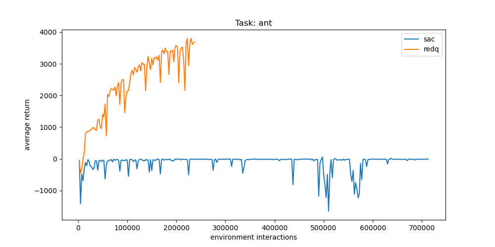

# Implementation of Randomized Ensembled Double Q-Learning(REDQ) Algorithm


This repository is a simple and readable implementation of REDQ algorithm proposed in ICLR 2021 paper [**Randomized ensembled double q-learning：learning fast without a model**](https://arxiv.org/abs/2101.05982).

Run following command to train:

```
python src/main.py --env_index 1 --algorithm sac --device cuda:1
```

-  env_index: 1 for 'hopper', 2 for 'walker', 3 for 'ant', 4 for 'humanoid'.
- alorithm: sac or redq

Each experiment will create a folder in output/, where data will be stored.

## Hyperparameters
- algorithm. redq or sac.
    - command line argument `--algorithm sac`

- $N$. ensemble size. number of Q functions. default: 20.
    - command line argument `--critic_num 20`

- $M$. number of Q functions selected when . default: 2.
    - command line argument `--critic_num_select 2`

- $G$. UTD(update-to-data) ratio. default: 20
    - how many times to train after one interaction with environment.
    - command line argument `--train_num 2`

- $\rho$. target smoothing coefficient. default: 0.005
    - command line argument `--critic_target_update_ratio 0.005`

- replay buffer size. default: 1e6.
    - command line argument `--replay_buffer_size 1000000`

<!-- | Symbol      | Description     | Default Value |
| ----------- | --------------- | ------------- |
| $\rho$      | target Q function update rate | 0.005 |
| Paragraph   | Text        | -->

## Experiments



